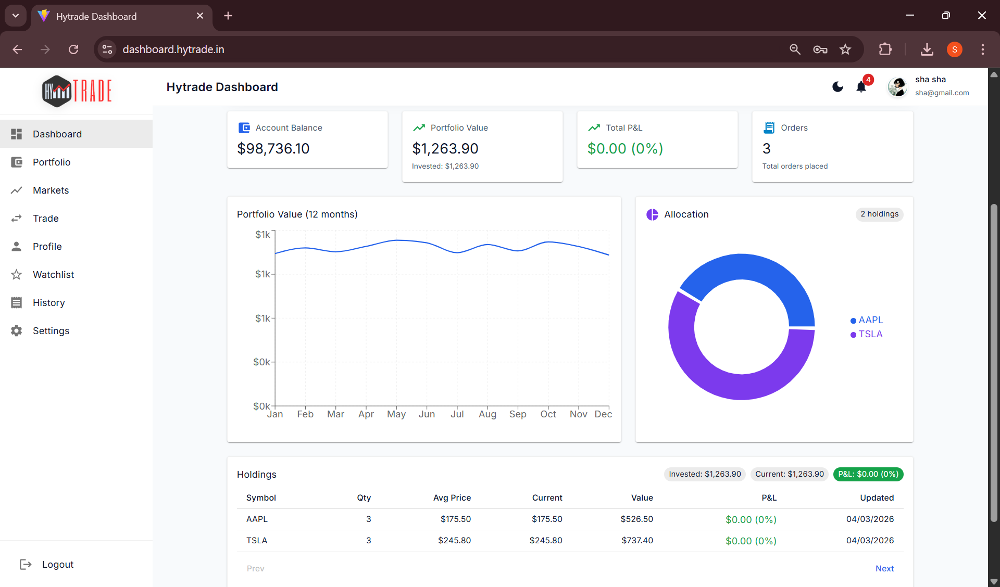
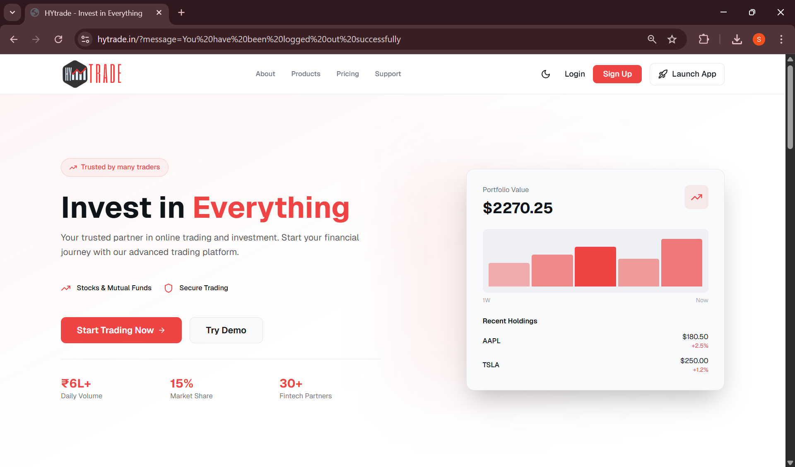
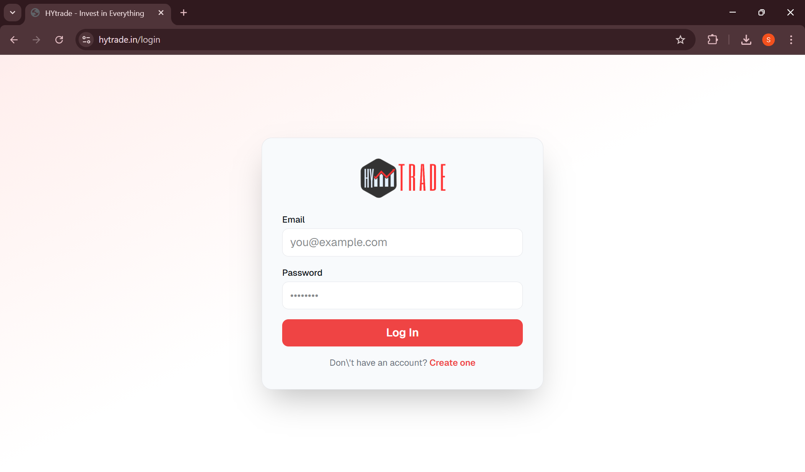
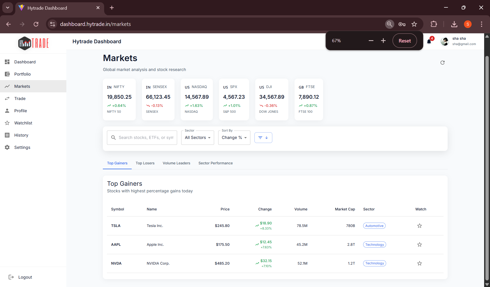
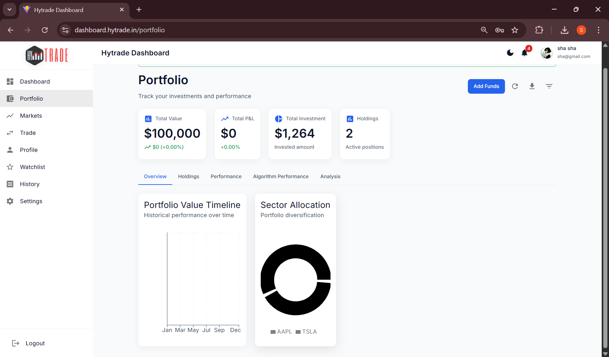
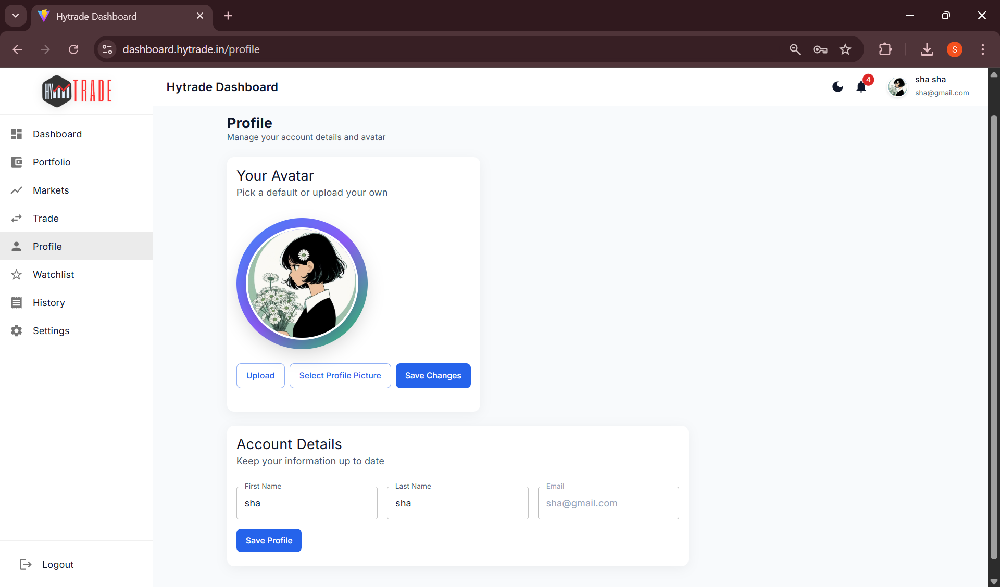
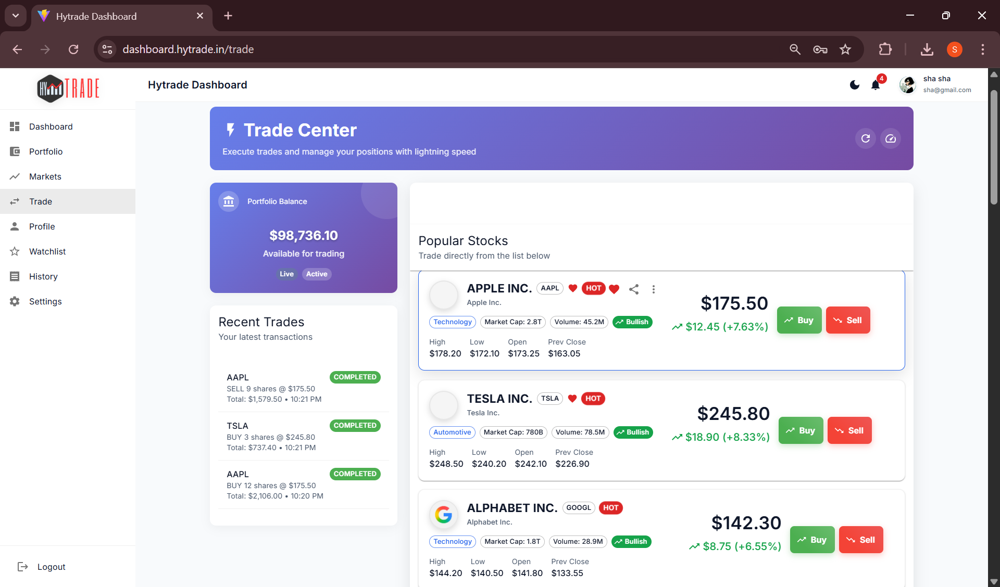

## Hytrade - Trade Simulation Platform

HyTrade is a full-stack stock trading simulation platform that allows users to practice trading with virtual money, track portfolios, and analyze market trends in a risk-free environment.

## 🛠 Tech Stack

Frontend
- React.js
- Material UI
- Chart.js

Backend
- Node.js
- Express.js
- REST APIs

Database
- MongoDB

Authentication
- JWT (JSON Web Tokens)
  
## 🌟 Features

- Secure user authentication using JWT
- Real-time stock market data tracking
- Portfolio performance analytics
- Interactive stock watchlist
- Trade execution simulation (buy/sell)
- Responsive UI built with React and Material UI

## 📸 Application Screenshots

### Dashboard


### Home Page


### Login Page


### Markets Page


### Portfolio Page


### Profile Page


### Trade Interface


## 🏗 System Architecture

              ┌────────────────────┐
              │     User Browser    │
              └──────────┬─────────┘
                         │
                         ▼
              ┌────────────────────┐
              │  React Frontend     │
              │ Dashboard + UI      │
              └──────────┬─────────┘
                         │ REST API
                         ▼
              ┌────────────────────┐
              │ Node.js + Express   │
              │ Backend Server      │
              └──────────┬─────────┘
                         │
                         ▼
              ┌────────────────────┐
              │      MongoDB        │
              │ Users / Portfolio   │
              │ Transactions        │
              └────────────────────┘

## 🔗 Key API Endpoints

POST /api/users/signup  
POST /api/users/login  
GET /api/portfolio/:userId  
POST /api/trades  
GET /api/stocks  
GET /api/trades/history/:userId

## 🚀 Quick Start

### Prerequisites

- Node.js (v14 or higher)
- npm (v6 or higher)
- MongoDB (v4.4 or higher) - [Download MongoDB](https://www.mongodb.com/try/download/community)

### Installation

1. **Clone the repository**
   ```bash
   git clone <repository-url>
   cd Hytrade-4
   ```

2. **Install dependencies**
   ```bash
   # Install backend dependencies
   cd backend
   npm install
   
   # Install dashboard dependencies
   cd ../dashboard
   npm install
   
   # Install frontend dependencies
   cd ../frontend
   npm install
   ```

3. **Set up environment variables**
   - Create a `.env` file in the `backend` directory with:
     ```
     PORT=3002
     MONGODB_URI=mongodb://localhost:27017/hytrade
     JWT_SECRET=your_jwt_secret_here
     NODE_ENV=development
     ```

### Running the Application

#### Option 1: Using the Setup Script (Recommended)

1. Make the script executable (Mac/Linux):
   ```bash
   chmod +x setup_and_run.sh
   ```

2. Run the script:
   - **Mac/Linux**: `./setup_and_run.sh`
   - **Windows**: Double-click `setup_and_run.bat` or run it from Command Prompt

#### Option 2: Manual Start

1. **Start MongoDB** (if not running as a service)
   ```bash
   mongod
   ```

2. **Start the backend server**
   ```bash
   cd backend
   npm start
   ```

3. **Start the dashboard** (in a new terminal)
   ```bash
   cd dashboard
   npm start
   ```

4. **Start the frontend** (in a new terminal)
   ```bash
   cd frontend
   npm start
   ```

## 🔗 Application URLs

- **Frontend**: http://localhost:3000
- **Dashboard**: http://localhost:3001
- **Backend API**: http://localhost:3002
- **MongoDB**: http://localhost:27017

## 📂 Project Structure

```
Hytrade-4/
├── backend/           # Node.js/Express API server
│   ├── models/        # MongoDB models
│   ├── routes/        # API routes
│   └── index.js       # Main server file
│
├── dashboard/         # React dashboard application
│   ├── public/        # Static files
│   └── src/           # React components and logic
│
├── frontend/          # React landing page
│   ├── public/        # Static files
│   └── src/           # React components and pages
│
├── screenshots/       # UI screenshots used in README
│   ├── dashboard.png
│   ├── home.png
│   ├── login.png
│   ├── markets.png
│   ├── portfolio.png
│   ├── profile.png
│   └── trade.png
│
├── setup_and_run.sh   # Setup and run script (Mac/Linux)
├── setup_and_run.bat  # Setup and run script (Windows)
└── README.md          # Project documentation
```

## 🛠 Development

### Available Scripts

#### Backend
```bash
cd backend
npm start       # Start the backend server
npm run dev     # Start in development mode with nodemon
npm test        # Run tests
```

#### Dashboard
```bash
cd dashboard
npm start       # Start the dashboard in development mode
npm run build   # Build for production
npm test        # Run tests
```

#### Frontend
```bash
cd frontend
npm start       # Start the frontend in development mode
npm run build   # Build for production
npm test        # Run tests
```

## 🔒 Authentication

### Test Account
- **Email**: test@example.com
- **Password**: password123

### API Authentication
All API requests (except auth endpoints) require a JWT token in the Authorization header:
```
Authorization: Bearer <your_jwt_token>
```

## 🌐 Deployment

### Production Build
1. Build all applications:
   ```bash
   cd frontend && npm run build && cd ..
   cd dashboard && npm run build && cd ..
   ```

2. Set `NODE_ENV=production` in your environment variables

3. Start the production server:
   ```bash
   cd backend
   npm start
   ```

## 📈 Project Impact

- Reduced API latency by ~30% through optimized MongoDB queries
- Improved dashboard rendering speed by ~40% via React state optimization
- Designed scalable APIs capable of handling 100+ concurrent socket connections
- 
## 📄 License

This project is licensed under the MIT License - see the [LICENSE](LICENSE) file for details.

## 🙏 Acknowledgments

- Built with React, Node.js, Express, and MongoDB
- Uses Material-UI for UI components
- Chart.js for data visualization
- And all the amazing open-source libraries we depend on!

 ## 👩‍💻 Author

Shalini Gupta  
Full Stack Developer | MERN Stack  

GitHub: https://github.com/ShaliniGupta122 ..final review it